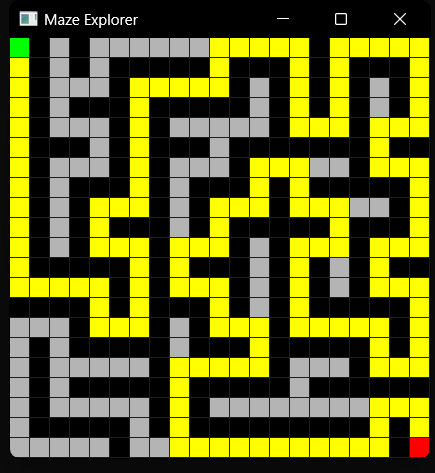

# MazeExplorer – Генератор лабиринтов и визуализация поиска пути

## Описание
Приложение генерирует идеальный лабиринт (рекурсивный бэктрекинг) и находит кратчайший путь от старта до финиша с помощью BFS. Визуализация – SFML.

## Технологии
- C++17
- CMake ≥ 3.10
- SFML 2.6.1 (графика, окно, события)

## Сборка и запуск

### Способ 1. Visual Studio (рекомендуемый)
1. Откройте папку проекта в VS: `File → Open → Folder`.
2. Выберите конфигурацию `x64-Release` или `x64-Debug`.
3. Постройте проект: `Build → Build All`.
4. Скопируйте все `.dll` из `E:/SFML-2.6.1/bin` в папку с `MazeExplorer.exe`.
5. Запустите `MazeExplorer.exe`.

### Способ 2. Командная строка (Developer PowerShell для VS 2022)
```bash
cd E:\pks\maze_generation
rm -Recurse -Force build
cmake -S . -B build -G "Visual Studio 17 2022" -A x64 -DCMAKE_PREFIX_PATH=E:/SFML-2.6.1
cmake --build build --config Release
# Скопируйте .dll из E:/SFML-2.6.1/bin в build/Release/
.\build\Release\MazeExplorer.exe
```
## Использование
- Зелёная клетка – старт, красная – финиш, жёлтый путь – найденный BFS.
- Закрытие окна – крестик.



## Внешние библиотеки
- **SFML 2.6.1** – подключена через `find_package` с указанием `CMAKE_PREFIX_PATH`.

